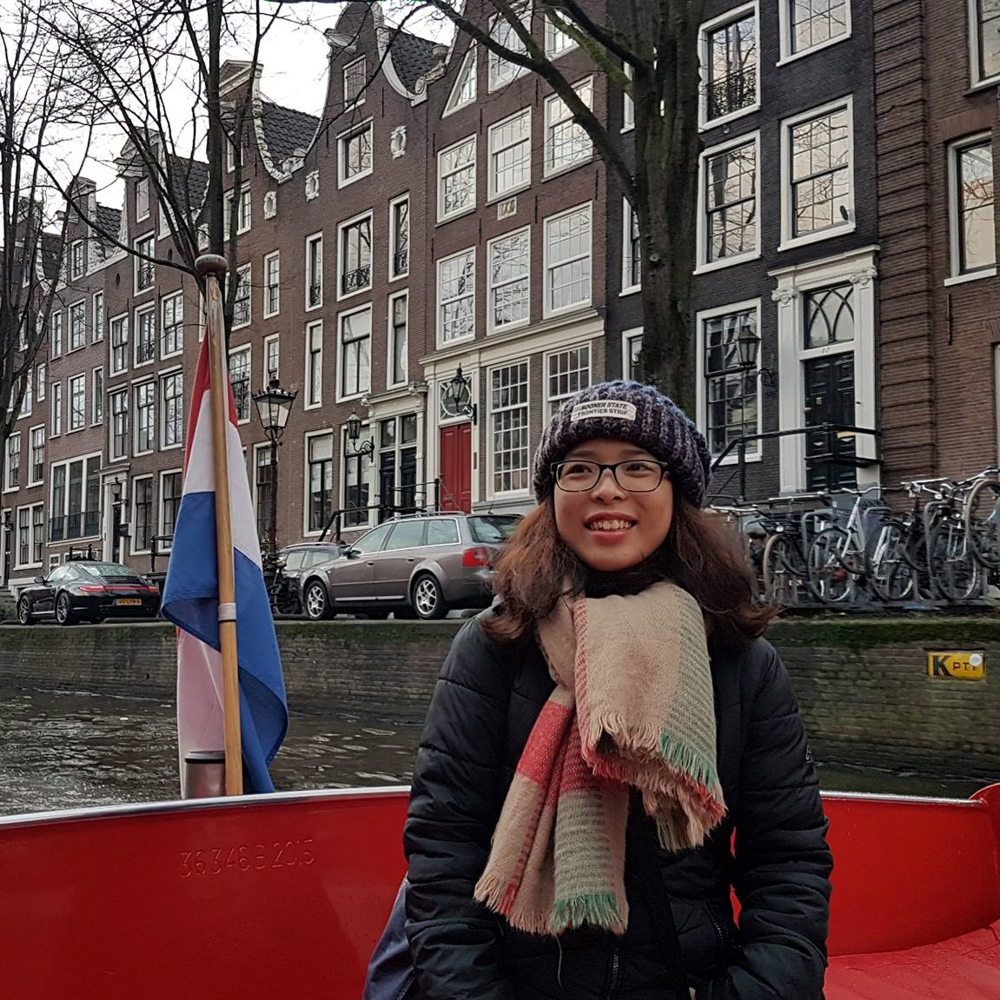

## About Me

Hi! I am a PhD candidate at Land and Water Management department, IHE Delft Instute for Water Education, the Netherlands. Having a background in Environmental Science, postgraduate study in Water Resources Engineering focusing on Earth Observation applications, and diverse volunteering experiences in environment and education projects, I'm interested in interdisciplinary research and applications towards a sustainable society.

## Research Interest

Sustainable Development | Water Resources Engineering | Remote Sensing | Open Science 

## Publications

### Journal aricles

1. **Tran, B.N.**, Van Der Kwast, J., Seyoum, S., Uijlenhoet, R., Jewitt, G. and Mul, M., 2023. Uncertainty assessment of satellite remote-sensing-based evapotranspiration estimates: a systematic review of methods and gaps. Hydrology and Earth System Sciences, 27(24), pp.4505-4528. [https://doi.org/10.5194/hess-27-4505-2023](https://doi.org/10.5194/hess-27-4505-2023)
2. Yalew, S.G., van der Zaag, P., **Tran, B.N.**, Michailovsky, C.I.B., Salvadore, E., Borgomeo, E., Karimi, P., Pareeth, S., Seyoum, S.D. and Mul, M.L., 2023. Open-access remote sensing data for cooperation in transboundary water management. Water International, 48(8), pp.955-974. [https://doi.org/10.1080/02508060.2023.2263226
](https://doi.org/10.1080/02508060.2023.2263226)
### Conference proceedings

1. **Tran, B.N.**, Van Der Kwast, J., Seyoum, S., Uijlenhoet, R., Jewitt, G. and Mul, M., 2022. Uncertainty in Satellite Remote Sensing Derived Evapotranspiration Estimation: Current Status and Assessment Methods. 39th IAHR World Congress From Snow to Sea. [https://doi.org/10.3850/IAHR-39WC2521711920221782](https://doi.org/10.3850/IAHR-39WC2521711920221782)
2. **Tran, B.N.**, Mul, M., Seyoum, S., and Wymenga, E., 2022. Monitoring Wetlands Dynamics in the Inner Niger Delta using Open-Access Remotely Sensed Evapotranspiration Data. 39th IAHR World Congress From Snow to Sea. [https://doi.org/10.3850/IAHR-39WC2521711920221154](https://doi.org/10.3850/IAHR-39WC2521711920221154)

### Reports

1. FAO, IHE Delft, 2019. Water Accounting in the Litani River Basin. WaPOR Water Accounting reports.
2. FAO, IHE Delft, 2020. Water Accounting in the Jordan River Basin. WaPOR Water Accounting reports.
3. FAO, IHE Delft, 2020. Water Accounting in the Niger River Basin. WaPOR Water Accounting reports.
4. FAO, IHE Delft, 2020. Water Accounting in the Nile River Basin. WaPOR Water Accounting reports.

## Education

Year | Degree | University
-----|-------|--------
2021 - Now | PhD Land and Water Management  | TU  Delft & IHE Delft, the Netherlands
2016 - 2018 | MSc Water Resources Engineering  | KU Leuven & VU Brussels, Belgium
2012 - 2015 | BSc Water - Environment - Oceanography | University of Science and Technology of Hanoi, Vietnam

---

## Contact

[Twitter](https://x.com/trngbich) | [Linkedin](https://www.linkedin.com/in/trngbich/) | [ResearchGate](https://www.researchgate.net/profile/Bich-Tran-9) | [Github](https://github.com/trngbich)

> How you do anything is how you do everything

